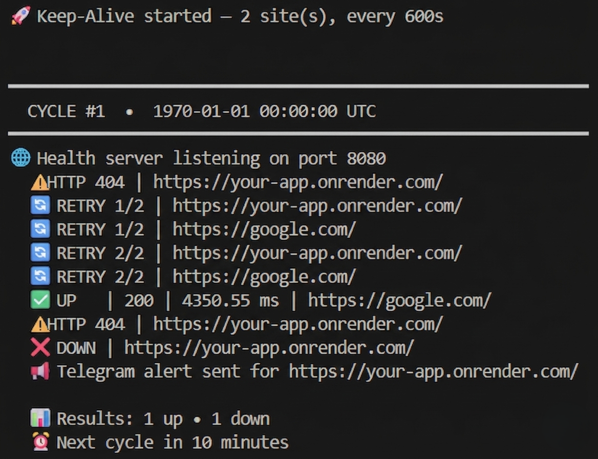
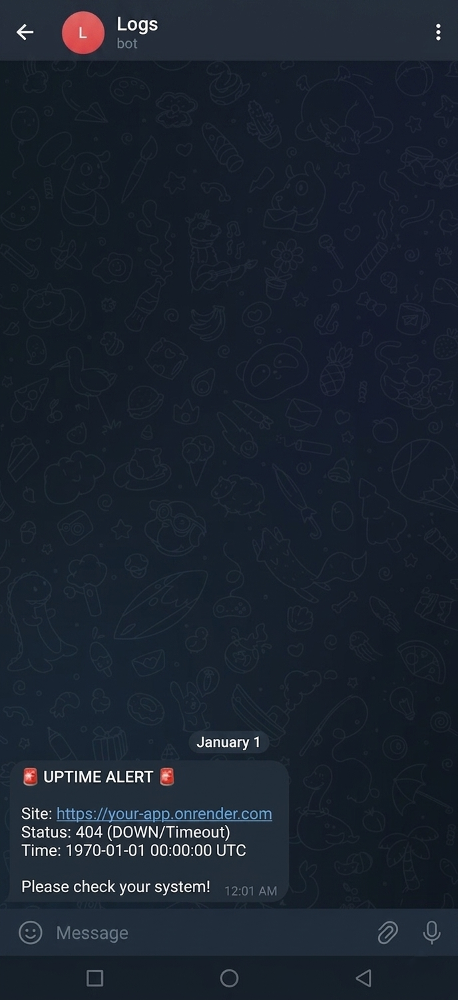

<div align="center">

# 🚀 Render Keep-Alive

**Prevent your free-tier Render services from sleeping with automated, concurrent pinging and instant Telegram alerts.**

<!-- GitHub Badges -->

<p>
  <a href="https://github.com/ITZ-NIHALPATEL/Render-Keep-Alive/stargazers"></a>
  <a href="https://github.com/ITZ-NIHALPATEL/Render-Keep-Alive/network"></a>
  <a href="https://github.com/ITZ-NIHALPATEL/Render-Keep-Alive/issues"></a>
  <a href="https://github.com/ITZ-NIHALPATEL/Render-Keep-Alive"></a>
  <a href="https://github.com/ITZ-NIHALPATEL/Render-Keep-Alive/commits/main"></a>
  <a href="https://github.com/ITZ-NIHALPATEL/Render-Keep-Alive/blob/main/LICENSE"></a>
  <a href="https://github.com/ITZ-NIHALPATEL"></a>
</p>

<!-- Tech Stack Badges -->

<p>
  <a href="https://www.python.org/"></a>
  <a href="https://render.com/"></a>
  <a href="https://www.json.org/"></a>
  <a href="https://core.telegram.org/bots/api"></a>
</p>

---

### ⭐ Support the Project

Show your support by starring the repository or forking it to set up your own keep-alive service!

[](https://github.com/ITZ-NIHALPATEL/Render-Keep-Alive/fork)
[](https://github.com/ITZ-NIHALPATEL/Render-Keep-Alive/stargazers)

</div>

---

## 📖 Table of Contents

- [About the Project](#-about-the-project)
- [Screenshots](#-screenshots)
- [Features](#-features)
- [Installation / Setup](#️-installation--setup)
- [Telegram Notifications Setup](#-telegram-notifications-setup)
- [Environment Variables](#-environment-variables)
- [Usage](#-usage)
- [How It Works](#️-how-it-works)
- [Project Structure](#-project-structure)
- [Contributing](#-contributing)
- [License](#-license)

---

## 🎯 About the Project

Free-tier hosting services like **Render** automatically spin down your web applications after 15 minutes of inactivity. This project solves that by deploying a lightweight Python pinger as its own Render web service — it continuously pings all your endpoints **concurrently** every 10 minutes, keeping them alive 24/7. If any service goes down, you receive an **instant Telegram alert**.

The pinger also pings **itself** via the `SELF_URL` environment variable, creating a self-sustaining loop that prevents its own Render service from ever spinning down.

---

## 📸 Screenshots

### Render Service Logs

Real-time logs showing concurrent pings with status codes and latency for each site.

<p align="center">
  
</p>

### Telegram Downtime Alert

Instant Telegram notifications with site URL, status, and UTC timestamp when a service goes down.

<p align="center">
  
</p>

---

## ✨ Features

- **⚡ Concurrent Pinging** — All sites are pinged at the same time using Python's `ThreadPoolExecutor`, not one-by-one.
- **🔄 Smart Retry Logic** — 2 automatic retries with a 5-second delay to avoid false positives from temporary network blips.
- **📱 Telegram Alerts** — Instant notification via Telegram bot when any site is confirmed down after retries.
- **⏱️ Runs Forever** — Pings every 10 minutes in an infinite loop. No cron jobs, no external schedulers.
- **🔁 Self-Ping** — Pings its own URL to prevent Render from spinning down the pinger itself.
- **🌐 Health Endpoint** — Built-in web server serves a JSON health check at `/` with latest ping results.
- **📦 Zero Dependencies** — Uses only Python standard library (`urllib`, `threading`, `concurrent.futures`). No `pip install` needed.
- **🔐 .env Support** — Built-in `.env` file loader for local development. On Render, use environment variables directly.

---

## 🛠️ Installation / Setup

1. **Fork the Repository** by clicking the "Fork" button at the top right of this page.

2. **Edit `sites.json`** in your forked repository — list the URLs you want to keep alive:

   ```json
   [
     "https://your-app.onrender.com",
     "https://app.onrender.com"
   ]
   ```

3. **Create a new Web Service** on [Render](https://render.com):
   - Connect your forked GitHub repository
   - **Runtime**: `Python`
   - **Build Command**: `echo "No build step"`
   - **Start Command**: `python Ping.py`
   - **Plan**: `Free`

4. **Set Environment Variables** in the Render dashboard (see [Environment Variables](#-environment-variables)).

---

## 🔔 Telegram Notifications Setup

To receive downtime alerts via Telegram:

1. Create a bot with [@BotFather](https://t.me/BotFather) on Telegram and copy the **Bot Token**.
2. Get your **Chat ID** from [@userinfobot](https://t.me/userinfobot) or similar.
3. Add both values as environment variables on Render (see below).

Alerts include:
- Site URL
- Status (DOWN / Timeout)
- UTC Timestamp

---

## 🔑 Environment Variables

Set these in the **Render Dashboard** → your service → **Environment**:

| Variable           | Required | Description                                                                 |
| ------------------ | -------- | --------------------------------------------------------------------------- |
| `SELF_URL`         | **Yes**  | Your Render service's own URL (e.g. `https://render-keep-alive-xxxx.onrender.com`). Enables self-ping to stay alive. |
| `TELEGRAM_TOKEN`   | Optional | Telegram bot token from [@BotFather](https://t.me/BotFather).              |
| `TELEGRAM_CHAT_ID` | Optional | Chat ID where alerts are sent.                                             |
| `PORT`             | Auto     | Render sets this automatically. No need to configure.                       |

> **Tip:** For local development, create a `.env` file in the project root. The script loads it automatically.

---

## 🚀 Usage

Once deployed and configured, the service runs fully autonomously:

- **Automatic** — Pings all sites from `sites.json` every **10 minutes**, forever.
- **Self-sustaining** — The `SELF_URL` self-ping keeps the pinger itself from sleeping on Render's free tier.
- **Health Check** — Visit your service URL in a browser to see a live JSON report:

  ```json
  {
    "status": "alive",
    "timestamp": "1970-01-01 00:00:00 UTC",
    "cycle": 42,
    "total_sites": 3,
    "up": 3,
    "down": 0,
    "results": [
      { "url": "https://your-app.onrender.com", "status": "up", "code": 200, "latency_ms": 285.3 },
      { "url": "https://app.onrender.com", "status": "up", "code": 200, "latency_ms": 312.7 }
    ]
  }
  ```

---

## ⚙️ How It Works

1. **Startup** — `Ping.py` starts a web server on the port Render provides and spawns a background pinger thread.
2. **Load Sites** — Reads all URLs from `sites.json` and appends `SELF_URL` (if set) to the list.
3. **Concurrent Ping** — Every 10 minutes, all sites are pinged **simultaneously** using `ThreadPoolExecutor`. Each request uses a GET method with a 10-second timeout.
4. **Retry on Failure** — If a site fails, it retries up to **2 more times** with a 5-second delay between attempts.
5. **Alert** — If all retries fail, a Telegram alert is sent with the site URL, status, and timestamp.
6. **Self-Ping** — The pinger's own URL is included in the ping list, creating an inbound request that resets Render's 15-minute inactivity timer.
7. **Health Endpoint** — The web server responds to any incoming request with a JSON report of the latest ping cycle results.

---

## 📂 Project Structure

```
Render-Keep-Alive/
├── Ping.py              # Main script — web server + background pinger
├── sites.json           # List of URLs to keep alive
├── .env.example         # Example environment variables
├── Screenshots/         # README screenshots
│   ├── Logs.png
│   └── TelegramNotification.png
├── LICENSE              # MIT License
└── README.md            # This file
```

---

## 🤝 Contributing

Contributions are what make the open-source community such an amazing place to learn, inspire, and create. Any contributions you make are **greatly appreciated**.

1. Fork the Project
2. Create your Feature Branch (`git checkout -b feature/AmazingFeature`)
3. Commit your Changes (`git commit -m 'Add some AmazingFeature'`)
4. Push to the Branch (`git push origin feature/AmazingFeature`)
5. Open a Pull Request

---

## 📄 License

Distributed under the MIT License. See `LICENSE` for more information.
