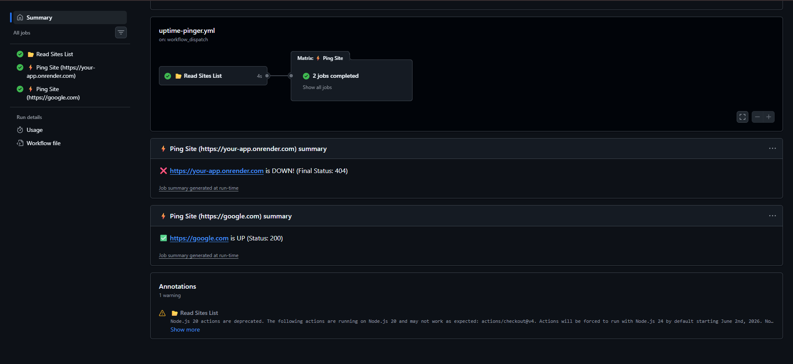
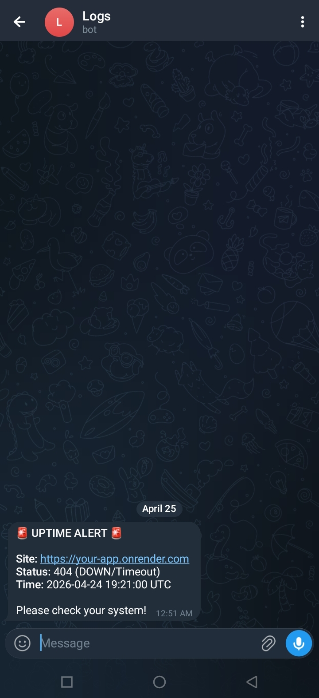

<div align="center">

# 🚀 Uptime Pinger

**Prevent your free-tier web services from sleeping with automated, parallel pinging and instant Telegram alerts.**

<!-- GitHub Badges -->

<p>
  <a href="https://github.com/ITZ-NIHALPATEL/Render-Keep-Alive/stargazers"></a>
  <a href="https://github.com/ITZ-NIHALPATEL/Render-Keep-Alive/network"></a>
  <a href="https://github.com/ITZ-NIHALPATEL/Render-Keep-Alive/issues"></a>
  <a href="https://github.com/ITZ-NIHALPATEL/Render-Keep-Alive"></a>
  <a href="https://github.com/ITZ-NIHALPATEL/Render-Keep-Alive/commits/main"></a>
  <a href="https://github.com/ITZ-NIHALPATEL/Render-Keep-Alive/blob/main/LICENSE"></a>
  <a href="https://github.com/ITZ-NIHALPATEL"></a>
</p>

<!-- Tech Stack Badges -->

<p>
  <a href="https://github.com/features/actions"></a>
  <a href="https://www.gnu.org/software/bash/"></a>
  <a href="https://www.json.org/"></a>
  <a href="https://curl.se/"></a>
</p>

---

### Support the Project

Show your support by starring the repository or forking it to set up your own uptime monitor!

[](https://github.com/ITZ-NIHALPATEL/Render-Keep-Alive/fork)
[](https://github.com/ITZ-NIHALPATEL/Render-Keep-Alive/stargazers)

</div>

---

## 📖 Table of Contents

- [About the Project](#-about-the-project)
- [Screenshots](#-screenshots)
- [Features](#-features)
- [Installation / Setup](#-installation--setup)
- [Telegram Notifications Setup](#-telegram-notifications-setup)
- [Usage](#-usage)
- [How It Works](#-how-it-works)
- [Contributing](#-contributing)
- [License](#-license)

---

## 🎯 About the Project

Free-tier hosting services like Render often put your web applications to sleep after a period of inactivity. This GitHub Actions workflow solves the problem by continuously pinging your specified endpoints, keeping them "awake." If any of your services go down or fail to respond, the script immediately alerts you via Telegram.

<p>
  
</p>

---

## 📸 Screenshots

### GitHub Actions Workflow Summary

The workflow runs parallel ping jobs for each site and provides a clear summary with UP/DOWN status indicators.

<p align="center">
  
</p>

### Telegram Downtime Alert

Instant Telegram notifications with site URL, HTTP status code, and UTC timestamp when a service goes down.

<p align="center">
  
</p>

---

## ✨ Features

- **⚡ Parallel Pinging**: Utilizes GitHub Actions matrix strategy to ping multiple websites concurrently for maximum efficiency without failing the entire workflow on a single error.
- **🔄 Smart Retry Logic**: Built-in 2-retry mechanism with a 5-second delay to avoid false positives caused by temporary network blips.
- **📱 Telegram Alerts**: Instantly notifies you on Telegram via a customized bot message the moment your website is unresponsive.
- **⏱️ Automated Checkups**: Runs automatically every 10 minutes via cron schedule.
- **🖱️ Manual Trigger**: Supports `workflow_dispatch` so you can manually trigger a ping check anytime through the GitHub UI.

---

## 🛠️ Installation / Setup

1. **Fork the Repository** clicking the prominent "Fork" button at the top right of this page.
2. In your forked repository, edit the `sites.json` file on the main branch.
3. List the complete URLs you want to monitor in JSON array format.

### 📝 Example `sites.json`

```json
[
  "https://your-app.onrender.com",
  "https://my-awesome-api.onrender.app",
  "https://personal-portfolio.com"
]
```

---

## 🔔 Telegram Notifications Setup

To receive downtime alerts, you need to set up two GitHub Secrets for your repository.

1. Go to your GitHub repository.
2. Navigate to **Settings** → **Secrets and variables** → **Actions**.
3. Under **Repository secrets**, click **New repository secret** to add the following:

- `TELEGRAM_TOKEN`: Your bot token obtained from [@BotFather](https://t.me/BotFather) on Telegram.
- `TELEGRAM_CHAT_ID`: Your personal or group Chat ID where the bot should send the messages (you can get this from [@userinfobot](https://t.me/userinfobot) or similar).

The workflow automatically securely reads these secrets and will format a detailed down alert, including:

- Site URL
- Error Code / Timeout Status
- UTC Timestamp

---

## 🚀 Usage

Once the `sites.json` is configured, and the Telegram Secrets are placed:

### Automated Runs

The workflow is scheduled to execute every **10 minutes** using the trigger:

```yaml
on:
  schedule:
    - cron: "*/10 * * * *"
```

_Note: GitHub Actions cron scheduling is subject to queue times, so checks might not occur exactly on the 10th-minute mark._

### Manual Check

You can trigger a manual check anytime:

1. Go to the **Actions** tab in your repository.
2. Select **🚀 Uptime Pinger** from the left sidebar.
3. Click **Run workflow**.

---

## ⚙️ How It Works

1. **Parsing List**: A preparation job runs first, securely reading the `sites.json` file and safely outputting it using `jq` to serialize it as a JSON string to a GitHub output parameter.
2. **Matrix Strategy**: The serialized string is dynamically fed into a GitHub matrix strategy `fromJson()`. This spawns up to 10 parallel jobs, each responsible for pinging exactly one site.
3. **Ping & Retry**: A small Bash script pings the endpoint taking a max time `-m 10` using `curl`.
   - If HTTP 2XX is returned, the check passes.
   - If it drops or times out, the command pauses for 5 seconds and tries again (max 2 retries).
4. **Alert Trigger**: If all attempts fail, the step cleanly exits, passing an explicit `code` and `status=down` payload to the next step.
5. **Telegram JSON Payload**: The final step conditionally runs if the app is marked 'down'. It maps the alert parameters using `jq` into safely escaped structural HTML formatted JSON for Telegram's SendMessage webhook API.

---

## 🤝 Contributing

Contributions are what make the open-source community such an amazing place to learn, inspire, and create. Any contributions you make are **greatly appreciated**.

1. Fork the Project
2. Create your Feature Branch (`git checkout -b feature/AmazingFeature`)
3. Commit your Changes (`git commit -m 'Add some AmazingFeature'`)
4. Push to the Branch (`git push origin feature/AmazingFeature`)
5. Open a Pull Request

---

## 📄 License

Distributed under the MIT License. See `LICENSE` for more information.
